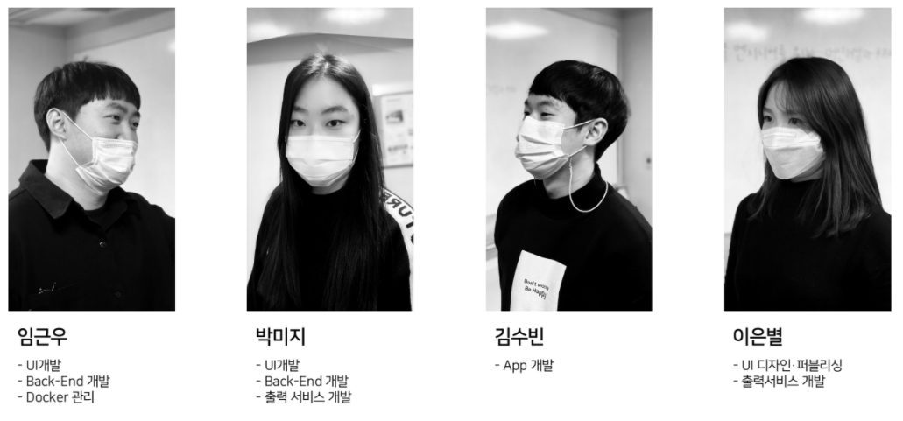
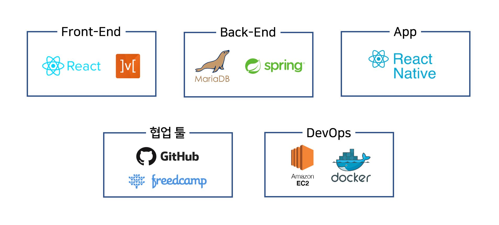
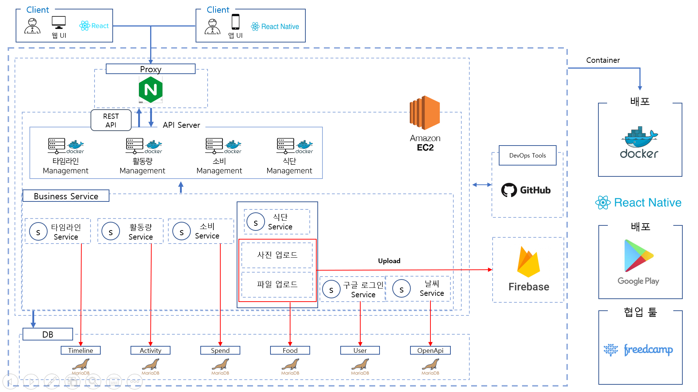

#  daily101

## ⚡️ 팀원소개<- 이모지로 바꾸기

<!--  -->
다시 설정 필요! 각자 사진 넣으셍~~

|                            임근우                            |                            박미지                            |                            김수빈                            |                            이은별                            |
| :----------------------------------------------------------: | :----------------------------------------------------------: | :----------------------------------------------------------: | :----------------------------------------------------------: |
|  |  |  |  |
|              [깃](https://github.com/keunwooo)               |              [깃](https://github.com/mijip0320)              |             [깃](https://github.com/souvenir718)             |      [:star:lebcoco:heart:](https://github.com/lebcoco)      |

# 시연 영상

### [🎬나의 하루를 daily101와 함께 사용한다면?](https://youtu.be/d-eDxZhvw5U)

### [🎬daily101 웹 서비스](https://youtu.be/qDHZRO_ShHM)

## :rocket:프로젝트 소개

##### 기억하고 싶은 나의 생활 정보, 쉽게 관리할 순 없을까? 

#### "daily101은 기억하고 싶은 정보를 자동으로 기록해줍니다."

**daily101**은 앱/웹 기반으로 동작하는 서비스입니다. 

원하는 생활정보를 선택하여 통합 관리를 할 수 있습니다.

개인의 하루 생활정보를 타임라인으로 쉽게 확인 할 수 있습니다.

#### :watch:타임라인

- **모바일 기반** 사용자 이동 데이터 중심의 **생활정보**를 시간순으로 기록합니다
- **타임라인**에서 오늘 나의 하루 생활정보를 **한 눈에 확인**할 수 있습니다.
- **시간순**으로 나열된 형태로 하루 일정과 기록 데이터를 파악하기 수월합니다.

#### :running:Life Style 관리

- 활동량: 자신의 신체 활동을 기록으로 남기고 시간대, 날짜별로 활동 기록을 확인 할 수 있습니다.

- 식단: 사진인식기능을 통해 하루 식단을 기록하고, 칼로리를 자동 계산합니다.

- 소비: 소비기록을 통해 하루동안 지출내역을 확인하고, 분야별 소비정도를 파악할 수 있습니다.

#### :fax:출력서비스

- 선택한 기간의 정보로 구성된 출력서비스를 제공합니다.
- 기념 목적의 앨범을 출력하여 추억할 수 있는 **나만의 기록물**을 만들 수 있습니다.
  - 사용자가 직접 edit하는 기능을 통해 **cusomizing**할 수 있습니다

## 🎯 기술 특장점<- 앱/웹 기반 기술 쓰기(앱: 김수빈, 웹: 박미지, 임근우)

### :iphone: 프론트엔드(앱)

- **Google Oauth**를 이용해 구글 로그인 기능을 구현했습니다.

  - 사용자에 대한 정보를 조회할 때 생성된 ID값으로 조회가 가능하게 됩니다.

- **타임라인**

  - **expo-location**를 이용해서 사용자의 위도, 경도를 저장했습니다.
    - 저장한 위도, 경도로 **Open weather map API**를 이용해서 현재 위치의 날씨를 표시했습니다.
    - 저장한 위도, 경도로 **구글 Map API**의 **reverseGeo**를 이용하여 주소를 표시했습니다.
    - 현재 사용자의 위치를 저장하여 **timeline** 서버로 데이터를 전송했습니다. 
  - **timeline** 서버로부터 받아온 정보를 날짜별로 표시했습니다.

- **활동량**

  - **activity** 서버로부터 받아온 정보를 날짜별로 표시했습니다.
    - 시간별로 소비 칼로리와 활동시간, 이동 거리를 표시했습니다.

- **소비**

  - **거래내역**
    - 날짜별 총 지출액과 지출내역에 대한 정보를 표시했습니다.
  - **통계차트**
    - 날짜별 지출내역에 대한 카테고리를 나눠서 그래프( **react-chartjs-2** )로 표시했습니다.
      - 교육, 패션/미용, 문화생활, 식비, 기타

- **식단**

  - 날짜별 먹은 음식 사진을 **Firebase**에 저장하고 불러옵니다.

  - 하루 총 섭취 칼로리와 먹은 음식 사진을 칼로리와 함께 표시했습니다.

    

###   :blue_book:프론트엔드(웹)

- **Google Oauth**를 이용해 구글 로그인 기능을 구현했습니다.
  - 사용자가 로그인 할 때 고유한 ID값과 토큰값을 받게 됩니다.
  - 추후 세션 유지하거나 해당 사용자에 대한 정보를 조회할 때 생성된 ID값으로 조회가 가능하게 됩니다.
- **Kakao Map API**를 사용해 사용자의 위치 표시 및 이동 거리를 지도 위에 표시했습니다.
  - 백엔드로 받은 정보를 지도 위에 표시해 사용자가 한눈에 확인 가능할 수 있도록 설정했습니다.
- 외부 그래프 라이브러리인 **react-chartjs-2**를 이용해 사용자의 하루 활동량과 소비 내역을 그래프로 표현했습니다.

###   :green_book:백엔드(Spring boot)

- 백엔드 서버는 googleLogin, timeline, activity, food, spending, openApis으로 총 6개의 서버로 이루어져 있습니다.
- **googleLogin**에서는 프론트로부터 입력받은 로그인 정보(ID, 비밀번호, 이름, 이메일 등등)를 Controller, DTO, Entity, Repository, 그리고 Service를 이용해 MariaDB에 저장 될 수 있게끔 설정했습니다.
- timeline에선 입력받은 날짜에 대한 사용자 정보를 조회/추가하고 사용자가 머물렀던 장소에 대한 좌표를 받아 거리 계산을 하여 총 이동거리를 계산해 제공합니다.
- 

 ### :whale:Docker 배포

- Amazon EC2를 이용해 docker를 설치하고 docker 컨테이너에 mariadb와 각각의 서버들을 설치해 언제 어디서든 서비스가 동작할 수 있게 설정했습니다.

## 🔗 기술스택

 

## 🔎 서비스 흐름도

## :art: ​Design 

​						:point_right: design 부분 update 예정

데일리 101 또는 뚝딱(dkdk)/도르마무/4season 팀 계정 만들기
